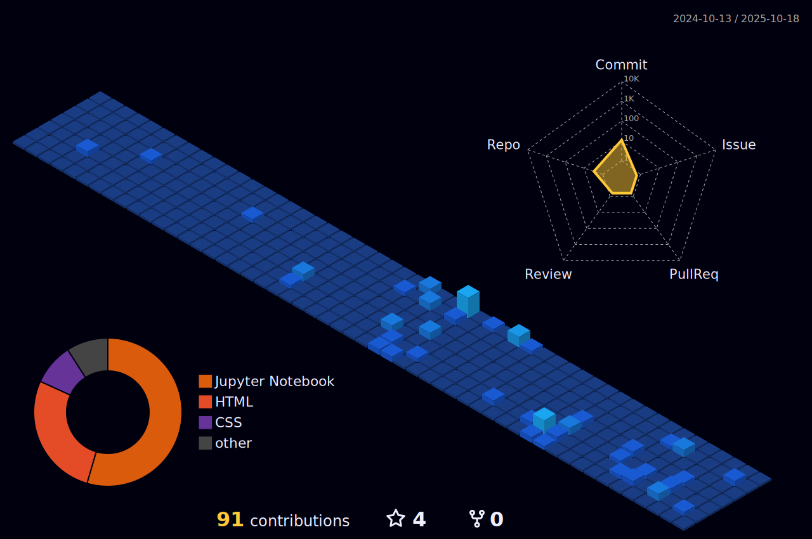

    

    <h1>
        
        Sobre Mi
        
    </h1>

- 👋 Soy Jesús Arroyo, estudiante de Ingeniería en Sistemas Computacionales en la [Escuela Superior de Cómputo (ESCOM)](https://www.escom.ipn.mx/) en la Ciudad de México.
- 🏆 Me apasiona el desarrollo de software y los proyectos creativos que presentan retos y oportunidades de aprendizaje.
- 🧑‍💻 Disfruto utilizando el software como herramienta para resolver problemas complejos.
- 💻 He trabajado con varios lenguajes de programación, siendo Python mi favorito por su versatilidad. Actualmente, estoy perfeccionando mis habilidades en Web Scraping.
- 🤓 Siempre en busca de nuevas habilidades y conocimientos en el campo de la informática.
- 🤔 Abierto a nuevas oportunidades de colaboración y aprendizaje.

      
    &emsp;
    
    &emsp;
    
    &emsp;
    
    &emsp;
    

    <h1>
        
        Mis Habilidades
        
    </h1>

<h3 align="center">
    <strong>🧑‍💻 Lenguajes de programación 🧑‍💻</strong>
</h3>

    
    &emsp;
    
    &emsp;
    
    &emsp;
    
    &emsp;
    
    &emsp;
    
    &emsp;
    
    &emsp;
    

    
    &emsp;
    

<h3 align="center">
     
    <strong>🎨 Desarrollo Frontend 🎨</strong>
</h3>

    
    &emsp;
    
    &emsp;
    
    &emsp;
    
    &emsp;
    
    &emsp;
    

<h3 align="center">
     
    <strong>💾 Bases de Datos 💾</strong>
</h3>

    
    &emsp;
    
    &emsp;
    
    &emsp;
    
    &emsp;
    

<h3 align="center">
     
    <strong>🛠️ IDEs 🛠️</strong>
</h3>

    
    &emsp;
    
    &emsp;
    
    &emsp;
    
    &emsp;
    

<h3 align="center">
     
    <strong>⚙️ Software & Herramientas ⚙️</strong>
</h3>

    
    &emsp;
    
    &emsp;
    
    &emsp;
    
    &emsp;
    
    &emsp;
    
    &emsp;
    
    &emsp;
    

    

<h3 align="center">
     
    <strong>🖥️ Sistemas Operativos 🖥️</strong>
</h3>

    
    &emsp;
    
    &emsp;
    

    

    <h1>
        
        Github Stats
        
    </h1>

<h3 align="center">
    <strong>💻 Estadísticas del perfil 💻</strong>
</h3>

    
    

<h3 align="center">
    <strong>⚡ Actividad reciente en GitHub ⚡</strong>
</h3>

    

<h3 align="center">
    <strong>🔥 Estadísticas de racha 🔥</strong>
</h3>

	  

<h3 align="center">
    <strong>🏆 Trofeos del perfil 🏆</strong>
</h3>

    

<h3 align="center">
    <strong>📂 Mis repositorios 📂</strong>
</h3>

    

        
        
    

<h3 align="center">
    <strong>📝 Resumen de contribuciones en 3D 📝</strong>
</h3>

    

        
    

<h3 align="center">
    <strong>🐍 Una serpiente devorando mi gráfico de contribuciones 🐍</strong>
</h3>

<picture>
    <source media="(prefers-color-scheme: dark)" srcset="https://raw.githubusercontent.com/Jisus-Dev/Jisus-Dev/output/github-contribution-grid-snake-dark.svg">
    <source media="(prefers-color-scheme: light)" srcset="https://raw.githubusercontent.com/Jisus-Dev/Jisus-Dev/output/github-contribution-grid-snake.svg">
    
</picture>